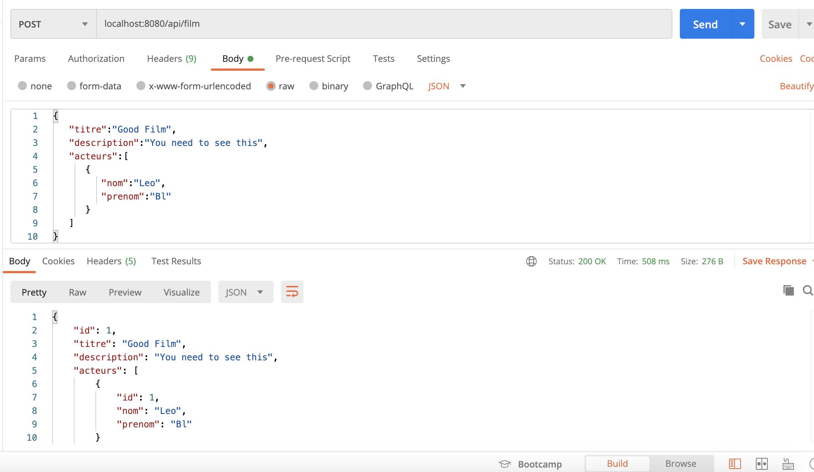
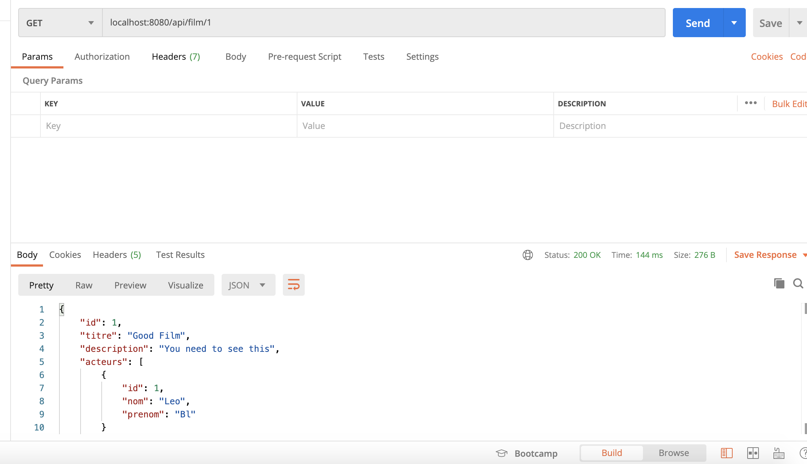

# FilmProject

C'est un simple projet API REST fait en Spring Boot

Il permet d'utiliser 2 endpoints:
- un endpoint GET ``` /api/film/{id} ``` pour avoir les details du film,
- et un autre endpoint POST ``` /api/film ``` pour enregistrer un film.

## Modèle de Film utilisé

```
{
    "id": long,
    "titre": string,
    "description": string
    "acteurs": [
        {
            "id": long,
            "nom": string,
            "prenom": string
        }
    ]
}
```

## Dépendances utilisées
- Java 11
- Spring Data JPA
- Base de donnée en mémoire H2
- Lombok 

## Avant de lancer ce projet 
Il est important de faire
``` ./mvnw clean install ``` ou ``` mvn clean install ```

## Test 

### Pour tester l'enregistrement du film
L'usage des Id pour enregistrer un film est optionnel, on peut ne pas l'ajouter et enregistrer un film, il va l'attribuer un id automatiquement.

#### Exemple de donnée de corps Raw de POST

```
{
   "titre":"Good Film",
   "description":"You need to see this",
   "acteurs":[
      {
         "nom":"Leo",
         "prenom":"Bl"
      }
   ]
}
```

#### Résultat




### Résultat pour avoir un film par son id

